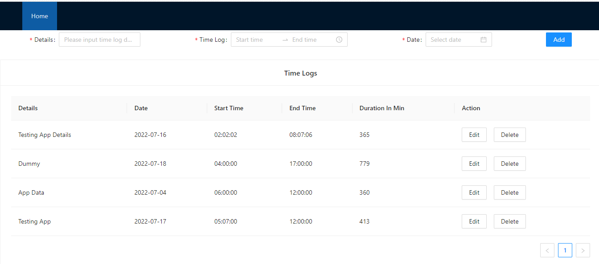
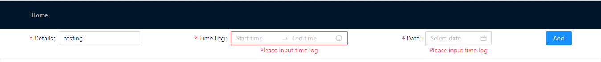
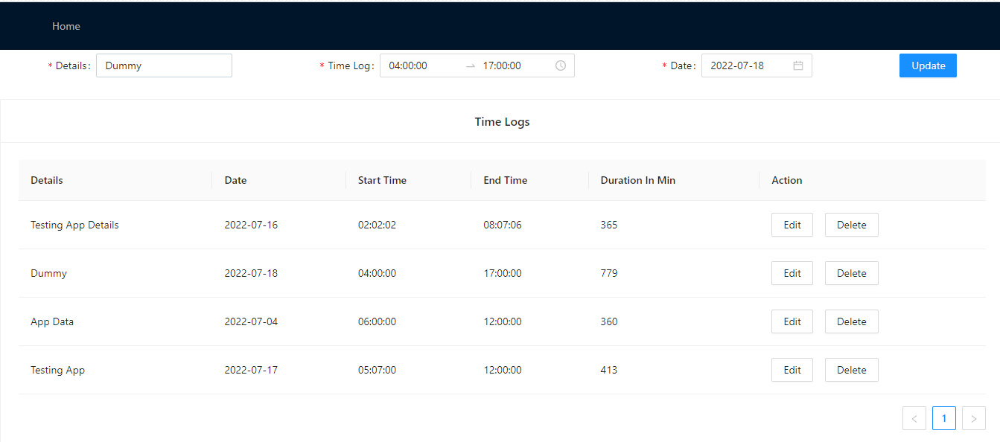
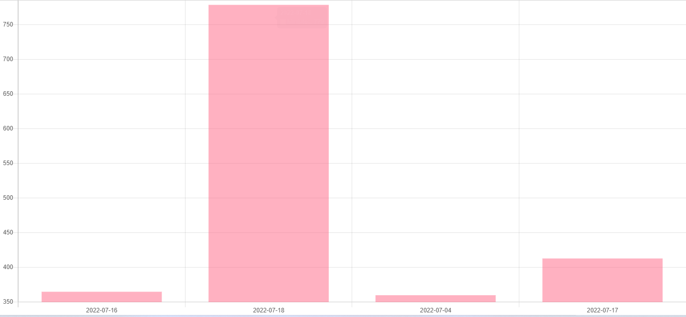

# Time Log App

This project was bootstrapped with [Create React App](https://github.com/facebook/create-react-app).

## Available Scripts

In the project directory, you can run:

### `npm install`|`yarn install`
Install the node_modules

### `npm start`| `yarn start`
Runs the app in the development mode.\
Open [http://localhost:3000](http://localhost:3000) to view it in your browser.

### `npm test`
Launches the test runner in the interactive watch mode.

### `npm run build`

Builds the app for production to the `build` folder.\
It correctly bundles React in production mode and optimizes the build for the best performance.

The build is minified and the filenames include the hashes.\
Your app is ready to be deployed!

# Tech stack
Web application based on React (clientside) and Antd (serverside)

# Features
Time entry
- [x] Can add time entry
- [x] Can track time entry 
- [x] Can list time entries
- [x] Delete time entry
- [x] Can Update time entries
- [x] Report

### Homepage
This is the main screen of the webapp. Here you can see all logs that user has posted, including ones that you've already made as well. For each log, you can see the Details, the start and end time, view logs, and post data.

